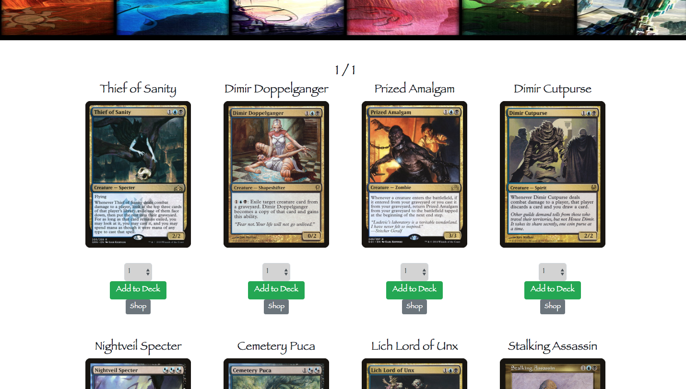
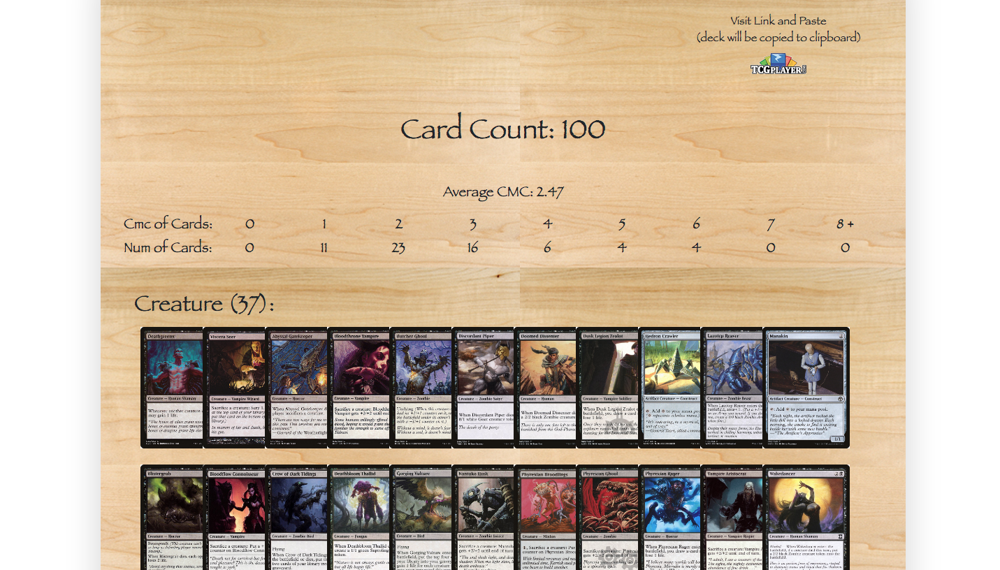
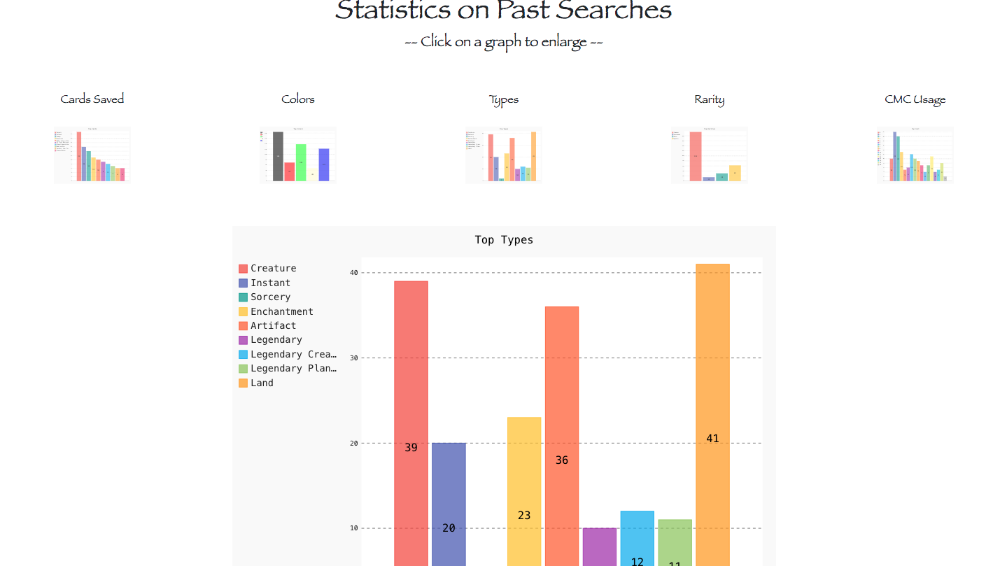

Programmer: Jesse Griffin  
Magic the Inquiry Card Search Website  

Program Description:  
    This program will run the server for an MTG cardsearch database.
    Once ran, it will ask the user if they want to
    index their database. If they have our SQL database
    set up, the server will save all tuples in the SQL
    database into the whoosh database. If none is chosen,
    the program will use the index already created and submitted
    with our project. At this point, the server will just alert
    when certain events happen on the site.
    
Preview:  
    Home Page  
      
    Results Page  
      
    Deckbuilder Page  
      
    Stats Page  
      

Run Program:  
    Must have database set up before program is ran. A db has
    been turned in with the program that should be created first.

    *** User might need to change code ***
    Program will assume username is 'root', host is 'localhost'.
    If this is not the case for you, code must be changed.
    The password will be asked of user at runtime.

    To run the program, use command:

    > python3 magicserver.py

    This will run the program. The server will then ask to be
    re-indexed. User should enter 'y' if they would like to
    index or 'n' to use the whoosh db already created.

    You can then visit the website at 'http://localhost:5000/'

